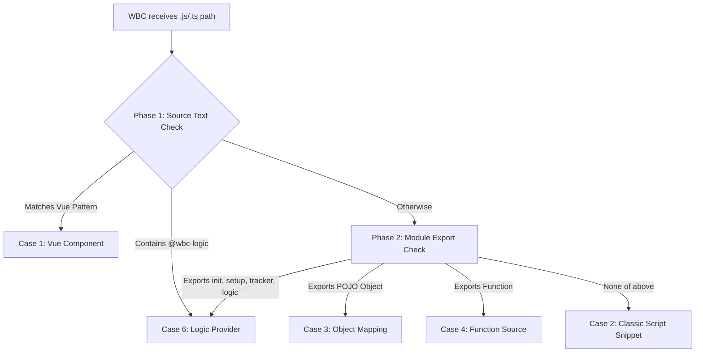

# WBC File Handling Guide

This document outlines the different scenarios for how the `WBC` component dynamically handles various file types.

## JavaScript & TypeScript File Handling (.js, .ts)

WBC employs a heuristic detection strategy to decide how to render a JavaScript or TypeScript file.

### JS Detection Flowchart



### Case 6: Logic Provider (Tiered Execution)

The most powerful extension point. Triggered by the `@wbc-logic` marker or specific function exports.

| Hook | Tier | Purpose |
| :--- | :---: | :--- |
| **`init(ctx)`** | ✅ FREE | Basic initialization (runs for all users). |
| **`setup(ctx)`** | 🔴 PRO | Module-level architecture configuration. |
| **`tracker(ctx)`** | 🔴 PRO | Reactive orchestration on every render cycle. |
| **`logic(ctx)`** | 🔴 PRO | General runtime logic injection. |

---

## The Pipe Syntax (`|`) — PRO Feature

WBC Pro allows combining content path, styling, and parsing in a single string.

**Format:**
`item="[FilePath] | [CSS_Classes] | [Link_URL] | [Explicit_Parser]"`

### Examples

```html
<!-- Render a .txt file as Python with custom styling -->
<WBC item="./script.txt | pa-3 highlight-dark | | python" />

<!-- Render markdown with a link wrapper -->
<WBC item="./info.md | elevation-2 | https://wbc-ui.com" />

<!-- Force render a .md file as JS code snippet -->
<WBC item="./info.md|||js" />
```

### Supported Parsers

`md`, `tex`, `python`, `js`, `html`, `json`, `txt`

---

## Programmatic Content Extraction — PRO Feature

Premium users access `ctx.content` for deep headless extraction:

```javascript
{
  input: {
    file: { js: "...", html: "...", md: "..." }, 
    item: "./sample.md"
  },
  output: {
    html: { pureHtml: "..." },
    md:   { pureMd: "..." },
    vNodes: { 
      main: VNode,   
      wbCode: VNode
    }
  }
}
```

The `output` property enables **God Mode Layout**: transform string keys like `'main'` or `'wbCode'` into their generated VNodes for complete layout orchestration.

---

## Supported File Types

| Extension | Rendering Behavior |
| :--- | :--- |
| `.md` | Parsed as Markdown, rendered as rich HTML |
| `.html` | Rendered directly as HTML content |
| `.json` | Rendered as a data-driven UI or displayed as formatted JSON |
| `.js` / `.ts` | Smart detection: Vue component, logic provider, object, function, or code snippet |
| `.tex` | LaTeX mathematical formula rendering (requires `@wbc-ui2/latex`) |
| `.mmd` | Mermaid diagram rendering (requires `@wbc-ui2/mermaid`) |
| `.txt` | Plain text display |
| `.css` | Syntax-highlighted code display |
| `.py` | Syntax-highlighted Python code |
| `.vue` | Live Vue component rendering |
| Images | Displayed inline (`.jpg`, `.png`, `.gif`, `.svg`) |
| Video | Embedded player (`.mp4`) |
