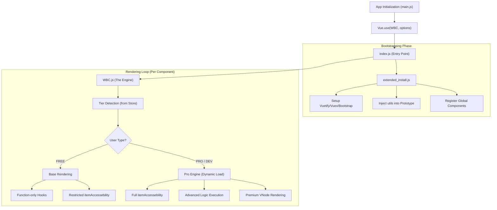

# WBC-UI2: Technical Architecture & Logic Flow

This document describes the interaction between core files and how the engine adapts to different license tiers and environments.

## 1. Core Architecture Flow



## 2. The `itemAccessebility` Proxy

The user **never** interacts with the raw Vue instance. Instead, they use a **controlled proxy** called `itemAccessebility` (referred to as `that` in `dive` mode):

```
┌───────────────────────────────────────────────────┐
│  User's World (item config with dive=true)        │
│                                                   │
│  comp: (that) => ...       // dynamic component   │
│  class: (that) => ...      // dynamic styling     │
│  click: (that, evt) => ... // interactive events   │
│  init: (that) => ...       // lifecycle setup      │
│                                                   │
│  "that" = itemAccessebility (the ONLY interface)  │
└───────────┬───────────────────────────────────────┘
            │  ← This is the GATE (the product)
┌───────────▼───────────────────────────────────────┐
│  WBC Internal World (Vue instance)                │
│  itemAccessebility decides what leaks through.    │
└───────────────────────────────────────────────────┘
```

### The Magic of `dive=true`

When `dive=true` is set, every property becomes a **function of the system state**:

```javascript
{
  dive: true,
  comp: (that) => that.lg.lang == 'en' ? 'VBtn' : 'VCard',
  options: {
    class: (that) => that.data.comp == 'VBtn' ? 'red' : 'green',
    on: {
      click: (that, evt) => {
        that.toggleHide(true);
      }
    }
  }
}
```

**`itemAccessebility` IS the product.** The difference between FREE and PRO is literally **what's inside `that`**.

## 3. File Roles & Responsibilities

| File | Primary Role |
| :--- | :--- |
| **`index.js`** | **The Gatekeeper**: Handles `Vue.use()` and orchestrates bootstrapping. |
| **`extended_install.js`** | **The Environment Builder**: Installs plugins (Vuetify, Bootstrap, Markdown). |
| **`WBC.js`** | **The Heart**: Controls the lifecycle and rendering of every WBC component. |
| **`pro/index.js`** | **The Premium Engine**: Architect features, strippable from free builds. |
| **`utils.js`** | **The Toolbox**: Helper functions and the security sandbox. |

## 4. Tiered Behavior

### A. Free Build (Production)
- **Tree-Shaking**: Pro code is physically removed from the bundle.
- `itemAccessebility` provides core rendering, state toggles, and basic lifecycle hooks.
- Logic hooks only support JavaScript Functions.

### B. Pro Build (Production)
- Full orchestration: `tracker`, `logic`, `setup`, `watch` hooks.
- Infrastructure access: `store`, `router`, `vm`, `data0`.
- Headless content extraction pipeline.

### C. Developer Environment
- Bypasses license checks for local testing.
- Visual debugging tools exposed to `window`.
- Detailed error reporting for logic providers.

---

## 5. Build Formats

| File | Format | Use Case |
| :--- | :--- | :--- |
| `wbc-ui2.es.js` | **ESM** | Modern bundlers (Vite, Webpack, Rollup) |
| `wbc-ui2.umd.js` | **UMD** | CDN / script tags in the browser |
| `wbc-ui2.full-embed.es.js` | **Full-Embed ESM** | Standalone — CSS injected by JS |
| `wbc-ui2.full-embed.umd.js` | **Full-Embed UMD** | Standalone browser — no separate CSS |

> **Tip**: The **Full-Embed** variants bundle the CSS directly into the JS. No separate `.css` import needed.
